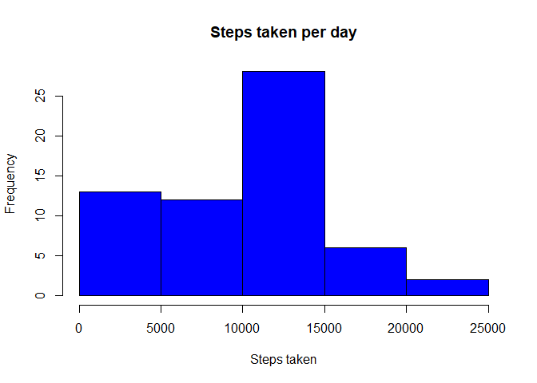
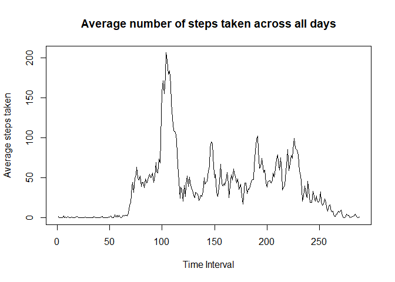
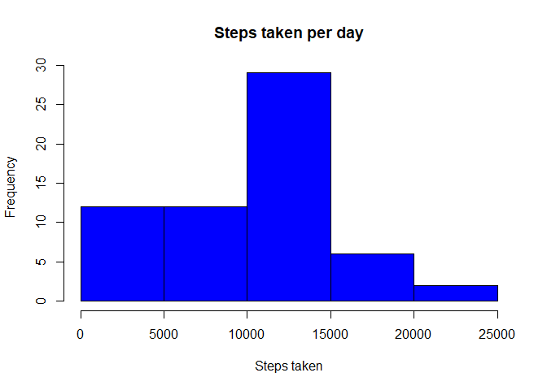
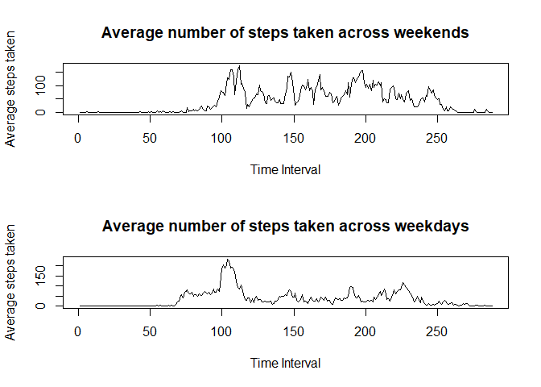

## Loading and preprocessing the data

```r
activity_data<-read.csv("C:\\Users\\Shrishti\\Downloads\\repdata_data_activity\\activity.csv")
activity_data$date<-as.character(activity_data$date)
activity_data$date<-as.Date(activity_data$date)
```
## What is mean total number of steps taken per day?

```r
library(dplyr)
```

```
## 
## Attaching package: 'dplyr'
```

```
## The following objects are masked from 'package:stats':
## 
##     filter, lag
```

```
## The following objects are masked from 'package:base':
## 
##     intersect, setdiff, setequal, union
```

```r
sumdata<-summarise_at(group_by(activity_data,date),vars(steps),funs(sum(.,na.rm = TRUE)))
```

```
## Warning: funs() is soft deprecated as of dplyr 0.8.0
## Please use a list of either functions or lambdas: 
## 
##   # Simple named list: 
##   list(mean = mean, median = median)
## 
##   # Auto named with `tibble::lst()`: 
##   tibble::lst(mean, median)
## 
##   # Using lambdas
##   list(~ mean(., trim = .2), ~ median(., na.rm = TRUE))
## This warning is displayed once per session.
```

```r
sumdata$mean.steps<-tapply(activity_data$steps,activity_data$date,mean,na.rm=TRUE)
hist(sumdata$steps, xlab = "Steps taken", main = "Steps taken per day", col = "blue")
```

<!-- -->

```r
mean(sumdata$steps)
```

```
## [1] 9354.23
```

```r
median(sumdata$steps)
```

```
## [1] 10395
```
## What is the average activity daily pattern?

```r
t<-tapply(activity_data$steps,activity_data$interval,mean,na.rm=TRUE)
plot(t,type="l",xlab = "Time Interval",ylab = "Average steps taken",main = "Average number of steps taken across all days")
```

<!-- -->

```r
t[which.max(t)]
```

```
##      835 
## 206.1698
```
So, from the Output it is observed that the maximum number of steps are taken in time interval 835.  

## Imputing missing values  
The missing values have been filled with the average number of steps in that particular time-interval.  

```r
##Calculate and report the total number of missing values in the dataset:
nas<-sum(!complete.cases(activity_data))
## filling in all of the missing values in the dataset and creating a new dataset:
activity_data2<-activity_data
activity_data2$steps[is.na(activity_data2$steps)]<-t[which(is.na(activity_data2$steps))]
activity_data2$steps<-round(activity_data2$steps,2)
##histogram of the total number of steps taken each day and the mean and median of the total number of steps taken per day
sumdata2<-summarise_at(group_by(activity_data2,date),vars(steps),funs(sum(.,na.rm = TRUE)))
sumdata2$mean.steps<-tapply(activity_data2$steps,activity_data2$date,mean,na.rm=TRUE)
hist(sumdata2$steps, xlab = "Steps taken", main = "Steps taken per day", col = "blue")
```

<!-- -->

```r
mean(sumdata2$steps)
```

```
## [1] 9530.723
```

```r
median(sumdata2$steps)
```

```
## [1] 10439
```
By comparing the 2 graphs it can be observed that, they are more or less similar. Also, by comparing the mean and median values we come to he same conclusion, as both the values have changed by only a small amount. But it is always better to impute the missing values to get accurate results and to avoid a bias in the data.  

## Are there differences in activity patterns between weekdays and weekends?  

```r
library(dplyr)
activity_data2$Day<-weekdays(activity_data2$date)
Weekendorday=factor(ifelse((activity_data2$Day=="Saturday")|(activity_data2$Day=="Sunday"),"Weekend","Weekday"))
activity_data2<-mutate(activity_data2,Weekendorday=Weekendorday)
t2weekday<-tapply(subset(activity_data,Weekendorday=="Weekday")$steps,subset(activity_data,Weekendorday=="Weekday")$interval,mean,na.rm=TRUE)
t2weekend<-tapply(subset(activity_data,Weekendorday=="Weekend")$steps,subset(activity_data,Weekendorday=="Weekend")$interval,mean,na.rm=TRUE)
par(mfrow=c(2,1))
plot(t2weekend,type="l",xlab = "Time Interval",ylab = "Average steps taken",main = "Average number of steps taken across weekends")
plot(t2weekday,type="l",xlab = "Time Interval",ylab = "Average steps taken",main = "Average number of steps taken across weekdays")
```

<!-- -->
  
Yes, there are differences in activity patterns between weekdays and weekends. It can be observed that the maximum number of steps on weekends and weekdays vary. On weekends, the maximum number of steps are around 175 whereas on weekdays te maximum value goes beyond 200. Also it is clearly visible that the except the maximum value, the number of steps taken are less on weekdays as compared to number of steps taken on weekends.
